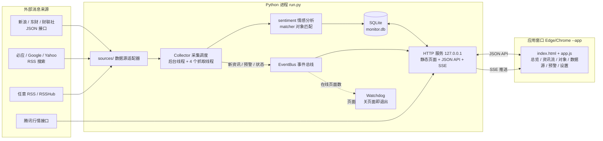
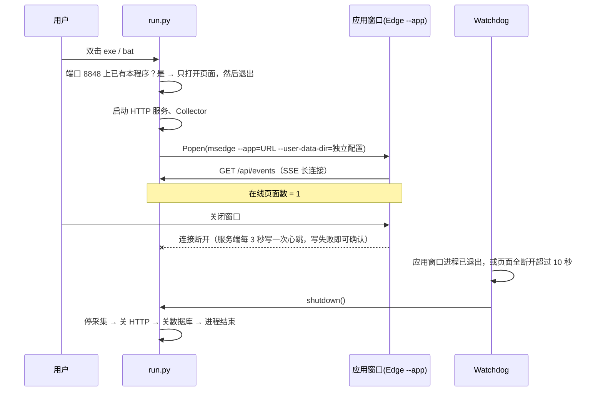
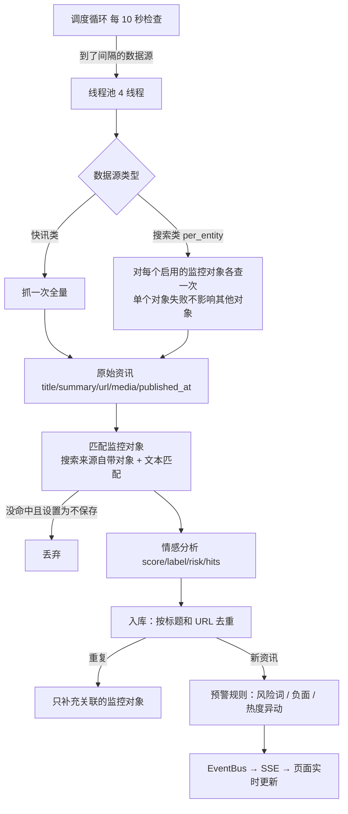

# 架构说明

## 1. 总体结构

整个系统是**一个 Python 进程加一个浏览器应用窗口**。Python 进程负责采集、分析、存储，同时提供 HTTP 服务；页面是本机服务提供的静态 HTML/JS，通过 JSON 接口取数据，通过 SSE 长连接接收实时推送。



### 技术选型和理由

| 选择 | 理由 |
| --- | --- |
| 纯 Python 标准库（urllib、sqlite3、http.server、xml.etree） | Windows 上装好 Python 就能运行，不用 pip；PyInstaller 打包体积小，也不容易出兼容问题 |
| SQLite（WAL 模式） | 单文件、零配置，备份只需复制一个文件；几十万条资讯的规模足够用 |
| 原生 HTML/JS，不引外部 CDN | 离线也能打开；不受国内访问 CDN 的影响；图表是手写的 SVG |
| SSE（Server-Sent Events）推送 | 单向推送已经够用，浏览器自带断线重连；连接本身也用来判断“页面是否还开着” |
| Edge/Chrome `--app` 模式 | 窗口像桌面程序一样没有地址栏；Windows 10/11 都自带 Edge |

## 2. 目录结构

```
sentiment-monitor/
├── run.py                    入口：启动服务、打开窗口、单实例检查、信号处理
├── start-windows.bat         Windows 双击启动（不显示命令行窗口）
├── start-windows-debug.bat   Windows 带日志窗口启动
├── start-mac-linux.sh
├── monitor/
│   ├── __init__.py           版本号
│   ├── paths.py              数据目录（%APPDATA%\SentimentMonitor）
│   ├── netutil.py            HTTP 抓取：gzip、编码识别（UTF-8/GBK）、代理、JSONP、错误转中文
│   ├── db.py                 SQLite 表结构、默认设置/数据源/监控对象、所有查询统计
│   ├── sources/              数据源适配器（每种来源一个类）
│   │   ├── base.py           Source 基类、时间解析、HTML 清洗
│   │   ├── cn_finance.py     新浪滚动、东财快讯、财联社电报、东财搜索
│   │   └── rss.py            通用 RSS/Atom 解析，Google/必应/Yahoo
│   ├── sentiment.py          情感词典 + 否定/程度处理 + 风险标签
│   ├── matcher.py            资讯 → 监控对象匹配（名称/别名/代码/排除词）
│   ├── collector.py          采集调度、入库流水线、预警规则
│   ├── quotes.py             腾讯行情（只用于显示涨跌）
│   ├── events.py             事件总线，同时统计在线页面数
│   ├── lifecycle.py          查找浏览器、启动应用窗口、Watchdog、控制台关闭处理
│   ├── server.py             HTTP 服务：路由、静态文件、SSE、安全检查
│   ├── demo.py               演示数据
│   └── web/                  index.html / style.css / app.js
├── tests/test_monitor.py     离线测试（含真实启动后“关页面即退出”的端到端测试）
├── packaging/build.py        PyInstaller 打包
└── docs/ARCHITECTURE.md      本文档
```

## 3. 前后台一起开、一起关

这是本系统和普通网页应用最大的不同，具体流程如下：



关键设计：

1. **独立的浏览器配置目录**（`--user-data-dir`）。Edge 会为这个窗口单独起一个主进程，不会合并进用户已经开着的 Edge，所以 `Popen` 拿到的就是这个窗口的进程，窗口关掉时进程也随之结束。
2. **两路检测，任意一路成立就退出**：
   - 应用窗口进程退出（启动后 5 秒内就退出的不算，那是窗口被交给了已运行的浏览器）；
   - 所有 SSE 连接断开超过宽限时间（默认 10 秒）。用户用普通浏览器打开时，靠这一路检测。
3. **宽限时间**：刷新页面时连接会断开 1 秒左右，宽限时间避免这时误退出。
4. **反方向也会关**：点“退出”、按 Ctrl+C，或直接关掉 Windows 控制台窗口（`SetConsoleCtrlHandler`）时，后台先通过 SSE 推送 `shutdown` 事件（页面显示“后台已退出”并尝试关闭窗口），然后结束它启动的浏览器进程。
5. **单实例**：启动时先请求 `http://127.0.0.1:8848/api/ping`，如果已有实例在运行，就只打开页面，不再启动第二个后台。
6. **可以关闭这个行为**：设置里关掉“关闭页面后自动退出后台”后，程序会一直在后台采集。

## 4. 采集流水线



- **去重**：`title_hash`（去掉 “ - 媒体名” 后缀和标点后的标题）与 `url_hash`（去掉 utm 等追踪参数后的链接）都设了唯一约束，同一条新闻从多个来源抓到时只保存一次。
- **时间**：统一保存为 Unix 秒（UTC）。国内接口返回的不带时区的时间按北京时间处理；页面按浏览器所在时区按天汇总。
- **失败处理**：每个数据源单独记录 `last_error`，并在页面上显示。网络错误会转成中文提示（超时、HTTP 状态码、连接失败）。
- **清理**：每小时清理一次超过保留天数的资讯和预警。

## 5. 数据模型（SQLite）

| 表 | 主要字段 | 说明 |
| --- | --- | --- |
| `entities` | name, code, market(A/HK/US), kind(stock/topic/company/person), aliases, exclude, enabled | 监控对象 |
| `sources` | type, name, params(JSON), enabled, interval_min, last_run/last_ok/last_error/last_count/last_new/total | 数据源配置和运行状态 |
| `articles` | title, summary, url, source_id, media, published_at, fetched_at, score, label, risk, hits, title_hash, url_hash | 资讯 |
| `article_entities` | article_id, entity_id | 资讯和对象多对多关联 |
| `alerts` | entity_id, article_id, kind(risk/negative/spike), level(danger/warning), message, is_read | 预警，(entity, article, kind) 唯一，避免重复预警 |
| `kv` | key, value | 设置（JSON） |

## 6. HTTP 接口

所有接口只监听 `127.0.0.1`。

| 方法 | 路径 | 说明 |
| --- | --- | --- |
| GET | `/api/ping` | 单实例检测 |
| GET | `/api/bootstrap` | 版本、设置、数据源类型目录、数据目录 |
| GET | `/api/overview?tz=&days=` | 总览：KPI、每日趋势、来源分布、对象热度榜、最新预警 |
| GET | `/api/articles?entity=&label=&source=&q=&days=&risk=&matched=&limit=&offset=` | 资讯查询 |
| GET | `/api/export?...` | 导出 CSV（带 BOM，Excel 直接打开） |
| GET/POST/DELETE | `/api/entities`、`/api/entities/{id}` | 监控对象增删改查 |
| GET | `/api/entities/{id}/trend` | 单个对象的每日趋势 |
| GET | `/api/quotes` | 行情（30 秒缓存） |
| GET/POST/DELETE | `/api/sources`、`/api/sources/{id}` | 数据源增删改查 |
| POST | `/api/sources/{id}/run`、`/api/refresh` | 立即抓取 |
| POST | `/api/sources/test` | 只抓取、不入库，返回预览 |
| GET/POST | `/api/alerts`、`/api/alerts/read` | 预警列表、标为已读 |
| GET/POST | `/api/settings` | 设置 |
| POST | `/api/demo`、`/api/clear`、`/api/shutdown` | 演示数据、清空、退出 |
| GET | `/api/events` | SSE：`hello` `articles` `alert` `source` `shutdown` |

**安全措施**：
- 检查 `Host` 头，只接受 `127.0.0.1` 和 `localhost`，防止 DNS 重绑定攻击；
- 所有写操作都要求带自定义请求头 `X-Monitor: 1`。其他网站发跨域请求时，浏览器会先做 CORS 预检并被拒绝，因此无法伪造这类请求；
- 静态文件做了路径穿越检查；
- 外部抓来的文本在页面上一律转义后再显示。

## 7. 扩展

**新增数据源**：在 `monitor/sources/` 里写一个类，然后加入 `sources/__init__.py` 的 `REGISTRY`。界面会根据 `params_spec` 自动生成参数表单，不需要改前端。

```python
class MySource(Source):
    type = "my_source"
    label = "我的数据源"
    desc = "说明文字"
    per_entity = False            # True 表示对每个监控对象分别调用 fetch
    params_spec = [{"key": "url", "label": "地址", "default": ""}]

    def fetch(self, params, entities):
        data = netutil.fetch_json(params["url"])
        return [{"title": ..., "summary": ..., "url": ..., "media": ..., "published_at": parse_time(...)}]
```

**更换情感模型**：`collector.ingest` 只调用 `sentiment.analyze(title, summary)`，返回 `{score, label, risk, hits}`。替换方式：

- 接入 OpenAI 兼容的大模型接口：批量把标题发给模型，让它返回 JSON 格式的分数和标签（建议只对命中监控对象的资讯调用，控制费用）；
- 本地模型：SnowNLP，或 FinBERT 一类的中文金融情感模型（需要额外安装依赖）。

**后续可以做的**：

| 方向 | 内容 |
| --- | --- |
| 来源 | 雪球、股吧、微博（通过自建 RSSHub，或者带 Cookie 的接口）；巨潮资讯公告；交易所问询函 |
| 分析 | 大模型摘要和事件分类；相似新闻聚类；舆情热度与股价走势叠加对比（分开两张图，不用双坐标轴） |
| 预警 | 企业微信 / 钉钉 / 飞书机器人 / 邮件推送；按对象设置不同阈值 |
| 体验 | 系统托盘图标（pystray）；开机自启；多个自选股分组 |
| 数据 | SQLite FTS5 全文检索；数据量增大后改用 PostgreSQL |
